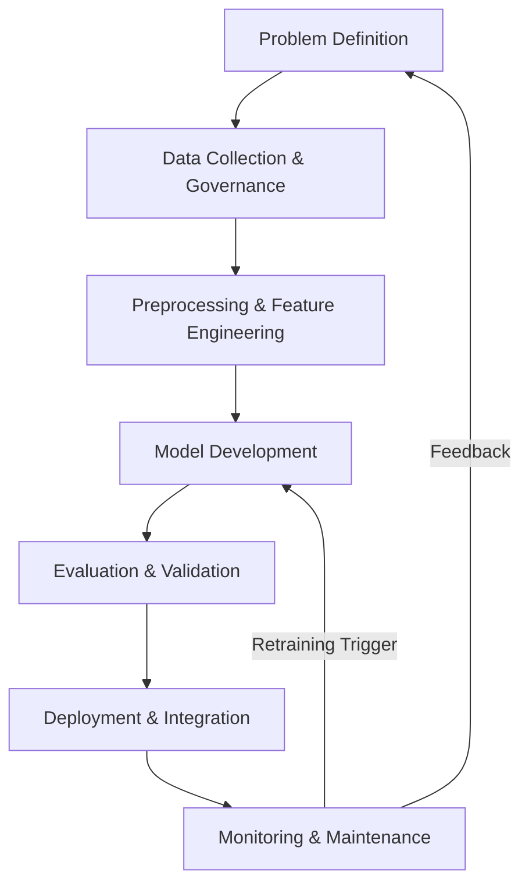

# Understanding the AI Development Workflow  
**Course:** AI for Software Engineering  
**Assignment Duration:** 7 Days  
**Team Members:** _Replace with names_

---

## Executive Summary
This report applies the AI Development Workflow to a hospital scenario where administrators need an AI system to predict whether a patient will be readmitted within 30 days of discharge. We walk through the end-to-end lifecycle—problem framing, data strategy, model development, evaluation, deployment, monitoring, and ethical considerations—while reflecting on challenges and future improvements. The document combines conceptual explanations, implementation artifacts, and governance guidelines to meet the assignment rubric.

---

## 1. Problem Definition
### 1.1 Hypothetical Use Case
- **Scenario:** Predict student dropout risk in an online bootcamp two weeks in advance.  
- **Objectives:**  
  1. Estimate dropout probability for each student with at least 85% AUROC.  
  2. Surface top three risk factors for each high-risk student.  
  3. Prioritize interventions for the top 15% high-risk cohort weekly.  
- **Stakeholders:** Program directors, student success coaches.  
- **Key Performance Indicator:** AUROC on holdout cohort ≥ 0.85.

### 1.2 Case Study Use Case
- **Scenario:** Forecast 30-day hospital readmission risk.  
- **Objectives:**  
  1. Identify high-risk discharges for early intervention.  
  2. Reduce readmission penalties by 10% within one fiscal year.  
  3. Provide explainable alerts that clinicians can trust.  
- **Stakeholders:** Chief Medical Officer, hospitalists, discharge planners, compliance officers, patients and families.

---

## 2. Data Collection & Governance
### 2.1 Data Sources
1. **Electronic Health Records (EHRs):** Diagnoses, vitals, lab results, procedure codes.  
2. **Insurance Claims:** Prior admissions, medication fills, length-of-stay metrics.  
3. **Social Determinants of Health (SDOH):** Community-level socio-economic indices, transportation access.  
4. **Clinician Notes:** Discharge summaries, care management plans.

### 2.2 Bias and Ethical Risks
- **Representation Bias:** Underserved populations may be underrepresented in historical datasets, leading to poorer model calibration for those groups.  
- **Measurement Bias:** Patients with limited access to care may have fewer recorded vitals or labs, artificially lowering risk scores.  
- **Mitigation Strategy:**  
  - Conduct stratified performance analyses by demographic group.  
  - Reweight or augment training data for underrepresented cohorts.  
  - Involve ethics board and community representatives in reviewing model outputs.

### 2.3 Data Governance
- **Compliance:** HIPAA mandates minimum necessary data sharing, audit logging, and breach notification plans.  
- **Security Controls:** Role-based access, encryption at rest (AES-256) and in transit (TLS 1.2+), secrets management via vault.  
- **Documentation:** Data dictionaries, lineage diagrams, clear consent records, and data-sharing agreements.

---

## 3. Preprocessing & Feature Engineering
### 3.1 Pipeline Steps
1. **Data Cleaning:** Handle missing demographics with k-NN imputation; median-impute numerical labs; drop columns with >40% missingness.  
2. **Normalization:** Z-scale lab values; min-max scale scores; log-transform skewed monetary features.  
3. **Categorical Encoding:** One-hot encode diagnosis groups; group rare categories into "Other".  
4. **Text Featurization:** Summaries embedded with clinical BERT (or TF-IDF baseline) averaged into fixed-length vectors.  
5. **Feature Engineering:**  
   - Charlson Comorbidity Index.  
   - Medication Possession Ratio (MPR).  
   - Rolling 7-day vitals stability score.  
   - Socio-economic composite from ZIP code data.  
6. **Class Imbalance Handling:** Apply SMOTE to oversample positive readmissions.

### 3.2 Data Splitting
- **Temporal Split:** 70% training (earliest discharges), 15% validation, 15% test (most recent discharges).  
- **Rationale:** Prevent information leakage from future data into model training.  
- **Stratification:** Ensures validation/test maintain representative class distributions.

---

## 4. Model Development
### 4.1 Candidate Models
- **Baseline:** Regularized logistic regression for interpretability.  
- **Primary:** LightGBM gradient boosting—handles heterogeneous tabular data, missing values, and supports SHAP explanations.  
- **Fallback:** Explainable neural network (TabNet) if richer interactions needed.

### 4.2 Hyperparameter Tuning
- `num_leaves`: Controls tree complexity.  
- `learning_rate`: Adjusts convergence speed versus overfitting.  
- `min_child_samples`: Prevents overfitting on low-sample splits.  
- `subsample` & `colsample_bytree`: Randomization for generalization.

### 4.3 Training Procedure
- Set global random seeds for reproducibility.  
- Use 5-fold cross-validation on training split for hyperparameter search.  
- Apply early stopping (patience 30 rounds) using validation AUC.  
- Log metrics and parameters to experiment tracker (e.g., MLflow or Weights & Biases).

---

## 5. Evaluation & Validation
### 5.1 Metrics
- **AUROC:** Measures ranking capability across thresholds.  
- **Average Precision (PR-AUC):** Sensitive to minority class performance.  
- **Recall @ 0.5 threshold:** Aligns with goal to capture high-risk patients.  
- **F1 Score:** Balances precision and recall.  
- **Calibration Curve:** Ensures predicted probabilities reflect true risk.

### 5.2 Confusion Matrix (Hypothetical)

|                | Predicted Readmit | Predicted Not Readmit |
|----------------|-------------------|------------------------|
| **Actual Readmit** | 120 (TP)          | 30 (FN)                |
| **Actual No Readmit** | 50 (FP)       | 300 (TN)               |

- **Precision:** 0.706  
- **Recall:** 0.800  
- **F1 Score:** 0.750  
- **AUROC:** 0.87  
- **PR-AUC:** 0.78

### 5.3 Error Analysis
- Investigate false negatives (missed high-risk patients) using SHAP importance.  
- Conduct fairness analysis by race, gender, and insurance type.  
- Perform clinician review sessions to validate edge cases.

---

## 6. Deployment Strategy
### 6.1 Technical Integration
1. Containerize preprocessing + model in a lightweight API service (FastAPI).  
2. Deploy within hospital network (on-premises Kubernetes) for HIPAA compliance.  
3. Schedule nightly batch scoring of discharged patients; push risk flags to EHR dashboard via FHIR API.  
4. Store predictions, explanations, and clinician feedback in monitoring database.

### 6.2 Operational Considerations
- **Scalability:** Microservice receives asynchronous scoring requests; horizontal pod autoscaling based on queue depth.  
- **Reliability:** Health checks, circuit breakers, and fallback to rule-based heuristic if service is unavailable.  
- **Auditability:** Immutable logs of inputs/outputs; versioned models and datasets.

### 6.3 Regulatory Alignment
- Implement Business Associate Agreement (BAA) with vendors.  
- Document algorithm change logs for FDA Emerging Technology requirements.  
- Conduct annual HIPAA risk assessments and privacy impact assessments.

---

## 7. Monitoring & Maintenance
### 7.1 Concept Drift
- **Definition:** Statistical properties of inputs/outputs shift over time, degrading model performance (e.g., new treatment protocols).  
- **Monitoring:** Monthly Population Stability Index (PSI) for top features with alert threshold 0.2.  
- **Trigger:** Retrain when validation AUROC drops by ≥0.02 or PSI breaches threshold on key features.

### 7.2 Feedback Loop
- Capture clinician overrides and reasons to enrich training data.  
- Schedule quarterly model governance meetings (data scientists, clinicians, compliance).  
- Maintain incident response playbooks for model failures or data breaches.

---

## 8. Critical Analysis
### 8.1 Ethical Implications
- Biased training data could underpredict risk for marginalized groups, leading to inadequate follow-up care and exacerbating health inequities.  
- Mitigation: fairness-aware reweighting, counterfactual testing, and community input into deployment policy.

### 8.2 Interpretability vs Accuracy
- Highly accurate deep models may be opaque, reducing clinician trust.  
- Trade-off: prefer LightGBM with SHAP for balance; provide interactive dashboards explaining top features per patient.  
- Limited compute resources further encourage tree-based ensembles over deep learning.

---

## 9. Reflection
- **Biggest Challenge:** Aligning technical design with strict privacy and compliance requirements while maintaining agility.  
- **Improvements with More Resources:**  
  - Build automated MLOps pipelines (feature store, continuous integration).  
  - Collect richer SDOH data and conduct user research on alert usability.  
  - Expand evaluation to real-world A/B tests with clinician workflows.

---

## 10. Workflow Diagram

---

## 11. References
1. CRISP-DM Consortium. “CRISP-DM 1.0: Step-by-step data mining guide.” 2000.  
2. Ribeiro, M. T., Singh, S., & Guestrin, C. “Why Should I Trust You? Explaining the Predictions of Any Classifier.” KDD 2016.  
3. Rajkomar, A., Dean, J., & Kohane, I. “Machine Learning in Medicine.” New England Journal of Medicine, 2019.  
4. U.S. Department of Health & Human Services. “Summary of the HIPAA Privacy Rule.” 2022.  
5. Wiens, J., et al. “Do no harm: a roadmap for responsible machine learning for health care.” Nature Medicine, 2019.

---

*Prepared for submission to PLP Academy Community and GitHub repository.*

